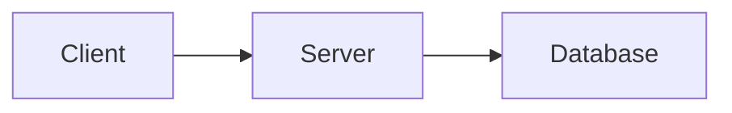

# Obsidian Knowledge System Skill

---

## 🎯 목적

이 스킬은 단순 정리가 아니라 **구조적 이해**를 위한 지식 문서를 만든다.

- 기술의 탄생 배경 이해
- 구조적 한계 극복 방식 이해
- 내부 동작 원리(low-level) 이해
- 설계 철학과 트레이드오프 분석
- 지식을 구조적으로 축적

설명의 큰 흐름은 항상 다음을 따른다:

> **배경 → 구조적 선택 → 내부 동작 → 한계 → 발전**

단, 이것은 **내용 전개의 방향**이지, 문장을 딱딱하게 잘라 쓰기 위한 형식 강제가 아니다.
항상 **블로그 글처럼 자연스럽게 이어지는 서술형 글**로 작성한다.
독자가 "문서를 읽는다"기보다 "한 편의 잘 정리된 기술 설명 글을 읽는다"는 느낌을 받아야 한다.

---

## 🔒 전역 규칙

1. **불필요한 멘트 금지**
   - 감탄, 군더더기 안내 멘트 제거
   - 바로 본문 시작

2. **확장 질문은 링크 금지**
   - `[[ ]]` 사용 금지
   - 일반 텍스트로만 작성
   - 예: `★★★★★ 왜 OSI 7계층은 7계층으로 설계되었는가?`

3. **신규 개념 발견 시**
   - 즉시 개념 문서 생성
   - 내용 없이 태그만 작성
   - 위치: `/concepts/`

4. **외부 참고 이미지 우선 사용**
   - 구조 이해에 도움이 되는 경우 반드시 이미지 검토
   - 공식/표준 문서 기반 자료 우선
   - 단순 장식용 이미지 금지
   - 이해를 실제로 돕는 이미지인지 먼저 판단

5. **글의 흐름은 자연스럽게 유지**
   - 섹션은 유지하되, 문체는 설명문이 아니라 **서사형 기술 글**에 가깝게 작성
   - 각 섹션이 서로 끊겨 보이지 않도록 연결 문장 사용
   - "그래서 이런 구조가 필요했는가?"가 자연스럽게 드러나야 함

6. **포맷보다 독해감을 우선**
   - 템플릿 구조는 유지
   - 하지만 문단 내부는 항목 나열보다 **흐름 있는 문장 중심**으로 작성
   - 지나치게 기계적인 정의식 문장 금지

7. **코드는 적극 활용하되 간결하게**
   - 동작 원리 설명에 도움이 된다면 코드 예시를 적극 삽입
   - 단, 코드는 핵심 포인트만 담은 **짧은 스니펫**으로 제한 (30줄 이내 권장)
   - 전체 구현 코드 금지 — 개념을 보여주는 최소 예시만 사용
   - 언어는 주제에 맞게 선택 (Java, C#, Python, pseudo-code 등)
   - 코드 앞뒤로 반드시 **문맥 설명 문장** 추가 — 코드만 덩그러니 두지 않음

---

## 🧠 노드 구조

### 1️⃣ 질문 노드

- 태그: `#질문`
- 위치: `/questions/`
- 제목은 반드시 질문 문장
- 기본 생성 대상

질문은 사고 확장의 출발점이다.

---

### 2️⃣ 개념 노드

- 태그: `#개념`
- 위치: `/concepts/`
- **자동 생성 금지**
- 사용자가 명시적으로 요청할 때만 내용 작성

단, 신규 개념 발견 시에는 빈 문서를 즉시 생성한다.
빈 문서라도 아래 태그는 반드시 포함해야 한다.

```markdown
#개념
```

내용은 나중에 채운다. 태그가 없으면 Vault 검색에서 누락된다.

---

## 🔍 개념 존재 검증 규칙 (필수)

1. **Vault 전체 검색**
   - 파일명 정확 일치
   - 헤더(`# 개념명`) 일치
   - 변형 검색 (띄어쓰기/대소문자)

2. **존재하면**
   - 기존 표준 이름 사용
   - `⚠ 기존 개념 재사용` 표시

3. **없으면**
   - 링크는 생성
   - 개념 노드는 빈 파일로 생성

4. **유사 개념 발견 시**
   - 병합 검토 필요 섹션에 기록

---

## 📏 링크 임계치 규칙

다음 중 하나 이상 해당할 때만 링크 생성:

- 독립적 메커니즘
- 프로토콜
- 계층 모델
- 알고리즘
- 구조적 설계 결정

**일반 용어 링크 금지.**

링크는 많이 거는 것이 목적이 아니다.
**구조를 이해하는 데 필요한 핵심 개념만 전략적으로 연결**한다.

---

## 🏷 네이밍 규칙

- `/` 사용 금지
- `HTTP/2` → `HTTP 2`
- 필요 시 별칭 사용: `[[HTTP 2|HTTP/2]]`
- 명칭 일관성 유지

---

## 🖼 이미지/도식 삽입 규칙

### 1️⃣ 사용 우선순위

1. 외부 참고 이미지 (공식 문서, RFC, 표준 기관, Wikimedia)
2. 직접 생성 도식 (Mermaid / PlantUML)
3. 표 형태 비교 정리

**언어 우선순위:** 한국어 이미지를 최우선으로 찾는다. 한국어 자료가 없거나 품질이 떨어질 경우에만 영문 이미지를 사용한다.

---

### 2️⃣ 외부 참고 이미지 사용 규칙

다음 중 하나라도 해당하면 **반드시 먼저 검색 후 삽입 검토**:

- 표준화된 계층 모델 존재
- 공식 구조 다이어그램 존재
- 프로토콜 시퀀스 흐름 설명 필요
- 렌더링/메모리/프로세스 흐름 시각화 필요
- 글만으로 이해하기 어려운 추상 구조가 등장
- 요청 주제가 네트워크, 브라우저, 운영체제, 렌더링, 아키텍처 구조 등 시각 자료의 효용이 큰 경우

**이미지 삽입 원칙:**

- 한 문서에 이미지가 **0장인 상태를 기본값으로 두지 않는다**
- 구조 이해에 도움이 된다면 **최소 1장 이상 삽입을 우선 검토**
- 가능하면 아래 형태를 우선 고려:
  - 전체 구조를 보여주는 이미지 1장
  - 세부 동작을 보여주는 이미지 1장
- 이미지가 없으면 이해가 떨어지는 주제에서는 이미지 삽입을 사실상 **필수**로 본다

**외부 이미지 품질 기준:**

- 출처 신뢰 가능
- 구조가 명확히 보임
- 지나치게 장식적이지 않음
- 문서의 설명 흐름과 직접 연결 가능
- 작은 해상도나 판독 어려운 이미지 지양

**저장 규칙:**

- 저장 위치: `/assets/images/`
- 파일명: `{개념명}-{핵심키워드}.png`

삽입 형식:
```
![[assets/images/HTTP-2-multiplexing.png]]
```

---

### 3️⃣ 직접 도식 생성 규칙

외부 이미지가 적절하지 않거나 원하는 설명 포인트를 정확히 담지 못할 경우 직접 생성한다.

특히 아래 상황에서는 직접 도식을 적극 사용한다:

- 외부 이미지가 너무 복잡함
- 설명하려는 흐름이 문서 맥락과 정확히 맞지 않음
- 요청 개념 간 관계를 간단히 재구성할 필요가 있음
- 비교 구조를 한눈에 보여줘야 함

예시:


---

## ✍️ 문체 및 서술 방식 규칙

### 핵심 원칙

이 문서는 백과사전처럼 쓰지 않는다.
강사가 칠판 앞에서 학생에게 설명하듯, 비유를 써서 쉽게 풀어내는 글이어야 한다.
읽는 사람이 "그래서 이런 기술이 나오게 되었구나"를 자연스럽게 따라갈 수 있어야 한다.

### 문단 구성 기준

- **한 문단 = 한 가지 생각**. 길게 늘어지면 두 문단으로 분리한다.
- **5개의 긴 문단보다 10개의 짧은 문단**이 낫다. 호흡이 짧아야 읽힌다.
- 문단과 문단 사이에는 흐름을 이어주는 연결 문장을 넣는다.
- 한 문단 안에서 새로운 개념이 등장하면 그 문단을 잘라낸다.

### 어투 기준

- **강사가 학생에게 설명하는 어투**로 쓴다.
- 비유를 적극적으로 활용한다. 추상적인 구조는 반드시 비유로 먼저 설명한다.
  - 예: "TCP의 3-way handshake는 전화 통화를 시작하기 전에 '여보세요 — 네, 들려요 — 저도 들려요'를 확인하는 것과 같다."
  - 예: "캐시는 자주 쓰는 물건을 책상 서랍에 넣어두는 것이다. 창고(메모리)까지 매번 걸어가지 않아도 되도록."
- 비유 다음에는 반드시 실제 기술 설명으로 연결한다. 비유에서 끝내지 않는다.
- "이렇게 하면 어떤 일이 생기냐면..."처럼 다음 내용을 자연스럽게 이어주는 표현을 자주 활용한다.

### 반드시 지킬 것

- 기술이 등장하기 전의 상황을 먼저 생생하게 묘사
- "그래서 이런 선택을 하게 되었다"는 흐름 유지
- low-level 설명은 반드시 포함하되, 비유로 먼저 풀고 기술 용어로 정착시키기
- 실제 동작 시나리오나 서비스 예시 포함
- 단순 항목 나열 금지

### 금지할 것

- 정의만 툭 던지는 문장
- 섹션마다 뚝뚝 끊기는 교과서식 문체
- 비유 없이 추상 개념만 반복하는 설명
- 문단 하나에 여러 개념을 욱여넣는 것

### 권장할 것

- "예전에는 왜 불편했는가"부터 시작
- 구조 변화의 이유를 먼저 설명
- 내부 동작은 데이터 흐름 기준으로, 비유로 먼저 그림을 그리고 기술 설명으로 연결
- 서비스 상황 예시를 짧게 삽입
- 필요한 지점에서 이미지와 설명을 연결

---

## 📄 질문 노드 작성 방식

본문 구조는 **강제하지 않는다.**
섹션 헤더를 붙일지 말지, 어떤 순서로 전개할지는 주제와 흐름에 따라 스스로 판단한다.

단, 내용 전개의 방향은 항상 이 흐름을 따른다:

> **배경 → 구조적 선택 → 내부 동작 → 한계 → 발전**

이것은 **목차가 아니라 사고의 흐름**이다.
헤더 없이 한 편의 글로 써도 되고, 필요한 곳에만 소제목을 붙여도 된다.
중요한 건 읽는 사람이 "왜 이 기술이 생겼는지"를 따라갈 수 있어야 한다는 것이다.

**작성 조건:**

- 블로그 글처럼 자연스럽게 읽히게 작성할 것
- 기술이 등장하기 전의 상황을 먼저 생생하게 묘사할 것
- "그래서 이런 선택을 하게 되었다"는 흐름으로 전개할 것
- low-level 설명은 반드시 포함하되, 이해하기 쉽게 풀어서 설명할 것
- 실제 동작 시나리오나 서비스 예시를 포함할 것
- 단순 항목 나열 금지 — 이야기처럼 이어지게 작성
- 이미지가 필요한 주제는 외부 참고 이미지부터 찾을 것
- 이미지가 설명의 핵심을 돕는다면 문단보다 먼저 보여줄 수도 있음

---

## 📄 질문 노드 템플릿

본문은 자유 서술. 맨 끝에 아래 두 섹션만 반드시 고정한다.

```markdown
# [질문 제목]

#질문

(본문 — 자유 서술. 섹션 헤더 강제 없음.)

---

## 🔎 확장 질문

★★★★★ [질문]

> [!important]
> 답변

★★★★☆ [질문]

> [!important]
> 답변

★★★☆☆ [질문]

> [!important]
> 답변

---

## 🧠 이해 점검 퀴즈

**Q1 (단답형)** [질문]

> [!important]
> 정답

**Q2 (서술형)** [질문]

> [!important]
> 정답

**Q3 (설계 의도)** 왜 이런 구조/설계를 선택했는가?

> [!important]
> 정답

---

## 🔎 개념 검증 결과

### ⚠ 기존 개념 재사용
[[개념명]]

### 🆕 신규 개념 후보
[[개념명]]

### 🔎 병합 검토 필요
[[개념A]] ↔ [[개념B]]
```

---

## 📦 확장 질문 작성 규칙

확장 질문은 단순히 다음 검색어를 뿌리는 용도가 아니다.
현재 문서를 읽은 사람이 **어디까지 사고를 확장하면 좋은지를 안내**해야 한다.

**규칙:**

- 반드시 현재 주제와 구조적으로 연결될 것
- 난이도와 중요도 차이를 별 개수로 표현
- 링크 금지 — 일반 텍스트로만 작성
- 질문만 쓰지 말고 **답변도 함께 작성**
- 답변은 반드시 **important box 안에 작성**
- 다음 문서를 만들 때 참고할 수 있도록 질문 문장 자체를 선명하게 만들 것

**예시 — "TCP는 어떻게 신뢰성을 보장하는가?" 문서의 확장 질문:**

```markdown
★★★★★ UDP는 왜 신뢰성을 포기했는가? 어떤 상황에서 UDP가 더 나은 선택인가?

> [!important]
> TCP의 신뢰성 보장 메커니즘(재전송, ACK, 흐름 제어)은 필연적으로 지연을 수반한다.
> 실시간 스트리밍, 게임, VoIP처럼 약간의 패킷 손실보다 지연이 더 치명적인 상황에서는
> UDP가 선택된다. 신뢰성을 포기한 게 아니라, 애플리케이션 레이어에서 직접 핸들링하는 구조다.

★★★☆☆ 3-way handshake는 왜 3번인가? 2번으로는 왜 안 되는가?

> [!important]
> 2-way라면 서버가 클라이언트의 수신 능력을 확인할 수 없다.
> 3번째 ACK가 있어야 양쪽 모두 "나도 보낼 수 있고, 너도 받을 수 있다"는 사실을
> 서로 확인한 상태가 된다. 이것이 신뢰할 수 있는 연결의 최소 조건이다.
```

---

## 🧠 이해 점검 퀴즈 작성 규칙

퀴즈는 암기 확인이 아니라 **구조를 이해했는지 확인하는 장치**여야 한다.

**규칙:**

- 단답형 1개
- 서술형 1개
- "왜 이런 설계를 했는가?" 질문 1개
- 정답은 반드시 **important box 안에 작성**
- 단순 용어 암기형 질문 금지
- 실제 설명 내용을 **자기 언어로 다시 떠올리게 만드는 질문** 우선

**예시 — "TCP는 어떻게 신뢰성을 보장하는가?" 문서의 퀴즈:**

```markdown
**Q1 (단답형)** TCP에서 패킷이 유실됐을 때 수신 측이 이를 알리는 메커니즘은?

> [!important]
> ACK 타임아웃 또는 중복 ACK(Duplicate ACK). 수신 측이 특정 시퀀스 번호에 대한
> ACK를 보내지 않거나, 같은 ACK를 3번 연속 보내면 송신 측은 해당 패킷을 재전송한다.

**Q2 (서술형)** TCP의 흐름 제어와 혼잡 제어는 어떻게 다른가?

> [!important]
> 흐름 제어는 수신 측 버퍼 크기 기반으로 송신 속도를 조절하는 것 (수신자 보호).
> 혼잡 제어는 네트워크 중간 경로의 혼잡 상태를 감지해 송신 속도를 줄이는 것 (네트워크 보호).
> 둘 다 속도를 줄이는 결과지만, 누구를 위한 보호인지가 다르다.

**Q3 (설계 의도)** TCP는 왜 시퀀스 번호를 랜덤한 초기값(ISN)으로 시작하는가?

> [!important]
> 이전 연결의 잔여 패킷이 새 연결에 섞이는 문제를 방지하기 위해서다.
> 고정값으로 시작하면 네트워크에 남아있던 이전 세션의 패킷이 유효한 패킷으로
> 오인될 수 있다. 랜덤 ISN은 이 충돌 가능성을 통계적으로 제거한다.
```

---

## ✏️ 가독성 작성 기준

- 문장은 짧게 작성
- **문단은 짧게** — 5개의 긴 문단보다 10개의 짧은 문단
- 문단 하나당 하나의 핵심 생각만 담기
- Low-level 설명도 비유로 먼저, 기술 용어는 그 다음
- 비유는 **적극 활용** — 추상 구조는 반드시 비유로 먼저 그린다
- 핵심 문장은 강조 블록 활용
- 항목 나열보다 문단 흐름 우선
- 이미지와 본문이 따로 놀지 않게 연결 설명 추가

---

## 🧭 운영 철학

> 질문은 사고 확장의 시작이다.
> 개념은 구조를 안정화한다.
> 링크는 전략적으로 생성한다.
> 설명은 항상 구조 중심으로 작성한다.
> 하지만 구조는 독해를 돕기 위한 뼈대일 뿐, 글 자체는 살아 있어야 한다.

좋은 문서는 정리만 잘된 문서가 아니다.
읽고 나서 **"왜 이런 기술이 생겼는지"가 머리에 남는 문서**다.