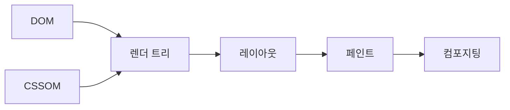

# CSSOM과 렌더링 성능은 어떤 관계가 있는가?

#질문

화면이 느리다고 하면 많은 사람이 JavaScript부터 떠올린다. 하지만 브라우저는 코드를 실행하기 전에 먼저 "이 요소가 어떤 모양이어야 하는가"를 계산해야 한다. 버튼 하나의 색, 카드의 폭, 글자의 줄바꿈 규칙이 정해지지 않으면 픽셀을 그릴 수 없기 때문이다. 그래서 스타일 계산은 렌더링 성능의 앞단에 놓인다.

이때 핵심이 [[CSSOM]]이다. 브라우저는 CSS 파일과 인라인 스타일, 기본 스타일 규칙을 파싱해 CSSOM을 만든다. 이것은 단순한 텍스트 모음이 아니라, 각 노드에 어떤 규칙이 적용될 수 있는지 판단하기 위한 구조화된 규칙 집합이다.

비유하면 DOM이 건물의 방 목록이라면 CSSOM은 각 방의 벽지, 조명, 가구 배치 원칙이 적힌 운영 매뉴얼이다. 방이 어디 있는지만 알아서는 집을 꾸밀 수 없고, 매뉴얼만 있어도 실제 방이 없으면 쓸 수 없다. 그래서 브라우저는 [[DOM]]과 CSSOM을 합쳐 [[렌더 트리]]를 만든다.

문제는 CSSOM이 바뀌면 그 뒤 단계가 연쇄적으로 흔들릴 수 있다는 점이다. 클래스 변경, 스타일 태그 삽입, 미디어 쿼리 변경, 웹폰트 로딩은 모두 어떤 노드의 computed style을 다시 계산하게 만든다. 그 결과 노드 크기나 위치가 달라지면 [[레이아웃]]이 다시 일어나고, 색이나 그림자만 달라져도 [[페인트]] 비용이 발생한다. 레이어 구성이 바뀌면 [[컴포지팅]]에도 영향을 준다.

이렇게 보면 "CSS는 선언형이라 싸다"라는 말은 반만 맞다. 선언형이어서 작성은 단순할 수 있지만, 브라우저는 그 선언을 실제 화면으로 풀어내기 위해 꽤 많은 계산을 한다. 특히 렌더링을 막는 큰 CSS 파일, 깊은 선택자, 빈번한 스타일 토글, 레이아웃에 영향을 주는 속성 변경은 성능에 직접 부담이 된다.

실제 서비스에서도 이 차이는 분명하다. 모달을 열 때 `opacity`만 바꾸면 비교적 가볍게 끝날 수 있지만, `width`, `height`, `top`, `left`를 반복적으로 바꾸면 문서 흐름 전체가 다시 계산될 수 있다. 그래서 스타일 최적화는 단순히 파일 크기를 줄이는 일보다, 어떤 속성을 언제 바꾸는지 이해하는 일에 더 가깝다.

결국 CSSOM과 렌더링 성능의 관계는 직선적이다. CSSOM은 화면 계산의 입력이고, 입력이 흔들리면 렌더 트리 이후 단계가 흔들린다. CSS를 잘 쓴다는 것은 보기 좋은 스타일을 만드는 것만이 아니라, 브라우저가 감당해야 할 계산 비용을 설계하는 일이다.

---

## 프론트엔드 개발자로써 이 내용을 활용할때 주의할 점

스타일 변경은 공짜가 아니다. 테마 전환, 애니메이션, 반응형 토글이 실제로 [[레이아웃]], [[페인트]], [[컴포지팅]] 중 어디까지 건드리는지 먼저 구분해야 한다.

실제 활용 단계에서는 `transform`, `opacity` 중심의 애니메이션, 크리티컬 CSS 분리, 스타일 계산 범위 축소가 중요하다. 성능 이슈를 "렌더링이 느리다"라고 뭉뚱그리지 말고 CSSOM 재계산 지점부터 추적해야 한다.

---

## 🔎 확장 질문

★★★★★ 어떤 CSS 속성이 레이아웃을 다시 일으키고, 어떤 속성이 컴포지팅 선에서 끝나는가?

> [!important]
> 크기와 위치를 바꾸는 속성은 레이아웃을 다시 유발하기 쉽고, `transform`과 `opacity`는 많은 경우 컴포지팅 단계에서 처리된다. 이 차이가 애니메이션 품질을 크게 바꾼다.

★★★★☆ 크리티컬 CSS는 왜 초기 렌더링 속도를 개선하는가?

> [!important]
> 첫 화면에 필요한 스타일을 먼저 확정하면 브라우저가 렌더 트리를 더 빨리 구성할 수 있다. 반대로 큰 스타일시트를 기다리면 첫 페인트가 지연된다.

★★★☆☆ 복잡한 선택자는 성능보다 유지보수에 더 큰 문제를 만드는가?

> [!important]
> 실제 런타임 비용도 있지만, 더 큰 문제는 적용 경로를 추적하기 어려워진다는 점이다. 디버깅이 느려지면 성능 문제를 찾아내는 속도도 떨어진다.

---

## 🧠 이해 점검 퀴즈

**Q1 (단답형)** DOM과 결합해 렌더 트리를 만드는 스타일 규칙 집합은 무엇인가?

> [!important]
> CSSOM.

**Q2 (서술형)** CSSOM 변경이 렌더링 성능에 영향을 주는 과정을 설명하라.

> [!important]
> CSSOM이 바뀌면 브라우저는 영향을 받는 노드의 computed style을 다시 계산한다. 그 결과 크기와 위치가 달라지면 레이아웃이, 색상이나 그림자가 달라지면 페인트가, 레이어 구성이 바뀌면 컴포지팅이 다시 수행된다.

**Q3 (설계 의도)** 브라우저는 왜 DOM만으로 렌더링하지 않고 CSSOM을 별도로 만들어 결합하는가?

> [!important]
> 문서 구조와 표현 규칙의 책임을 분리하면서도 최종 화면 계산을 일관되게 하기 위해서다. 스타일 규칙을 별도 모델로 관리해야 선택자 매칭, 상속, 우선순위 계산을 체계적으로 처리할 수 있다.

---

## 🔎 개념 검증 결과

### ⚠ 기존 개념 재사용
[[CSSOM]]
[[DOM]]
[[렌더 트리]]
[[레이아웃]]
[[페인트]]
[[컴포지팅]]
[[리플로우]]
[[리페인트]]

### 🆕 신규 개념 후보

### 🔎 병합 검토 필요
[[리플로우]] ↔ [[레이아웃]]
[[리페인트]] ↔ [[페인트]]
