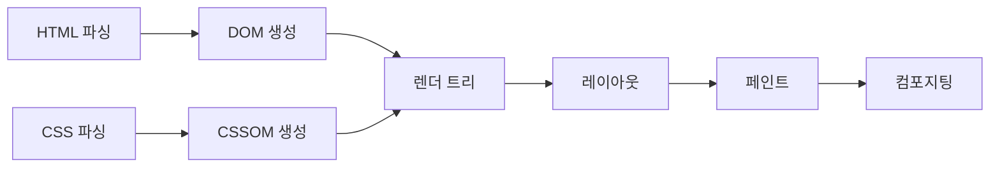

# CSS는 어떤 문제를 해결하기 위해 등장하였는가?

#질문

초기의 웹은 전자 문서를 서로 연결해 읽게 만드는 데 집중했다. 그래서 [[HTML]]은 제목, 문단, 링크처럼 문서의 뼈대를 설명하는 일에는 적합했지만, "이 문서를 화면에서 어떻게 보이게 할 것인가"까지 세밀하게 다루기에는 거칠었다. 같은 문서를 데스크톱과 다른 해상도에서 읽을 때도 표현을 일관되게 맞추기 어려웠고, 사이트 전체의 글꼴과 여백을 바꾸려면 페이지마다 손으로 수정해야 했다.

이 불편은 금방 구조적 문제로 드러났다. 문서 구조와 표현 규칙이 섞여 있으면 콘텐츠를 수정할 때 스타일이 같이 흔들리고, 스타일을 수정할 때 문서 내용까지 건드리게 된다. 옷장에 셔츠를 정리하는 기준과 셔츠의 색을 칠하는 작업이 한 서랍에 뒤엉켜 있는 셈이다. 그래서 웹은 구조는 HTML이, 표현은 [[CSS]]가 맡는 쪽으로 나뉘었다.

![[assets/images/CSS-박스모델.svg]]

브라우저 내부에서는 이 분리가 꽤 기계적으로 처리된다. 브라우저는 HTML을 읽어 [[DOM]]을 만들고, CSS를 읽어 [[CSSOM]]을 만든다. 그다음 이 둘을 조합해 화면에 실제로 그릴 노드만 담은 [[렌더 트리]]를 만든다. 이후 [[레이아웃]] 단계에서 각 박스의 위치와 크기를 계산하고, [[페인트]]와 [[컴포지팅]] 단계를 거쳐 픽셀로 바꾼다. 구조와 표현을 나눠도 결국 한 화면으로 합쳐질 수 있는 이유가 여기에 있다.

이렇게 하면 어떤 일이 생기냐면, HTML은 문서 의미와 접근성을 유지한 채로 남고 CSS는 테마, 반응형 규칙, 애니메이션, 인쇄 스타일처럼 표현만 선언적으로 바꿀 수 있게 된다. 서비스 운영에서는 이 차이가 크다. 다국어 페이지를 추가하거나 브랜드 리뉴얼을 할 때 문서 구조를 대거 뒤엎지 않고 스타일 레이어를 중심으로 조정할 수 있기 때문이다.

물론 CSS가 모든 문제를 끝낸 것은 아니다. 전역 규칙이 많아질수록 [[Cascade]]와 [[Specificity]] 때문에 예상하지 못한 덮어쓰기가 생긴다. 그래서 BEM, 전처리기, 디자인 토큰, CSS-in-JS 같은 운영 기법이 뒤따라 나왔다. 하지만 그건 CSS의 실패라기보다, 표현 계층이 독립한 뒤 대규모 시스템에서 어떻게 질서를 유지할지에 대한 다음 단계의 문제에 가깝다.

결국 CSS는 "보기 좋게 꾸미는 언어"라기보다, 웹 문서에서 표현 책임을 별도 계층으로 떼어내기 위해 등장한 언어다. 이 분리가 있었기 때문에 웹은 단순한 하이퍼텍스트 문서에서, 상호작용과 브랜딩을 갖춘 애플리케이션 화면으로 발전할 수 있었다.

---

## 프론트엔드 개발자로써 이 내용을 활용할때 주의할 점

CSS를 단순한 장식 도구로 보면 규모가 커질수록 바로 무너진다. 컴포넌트 경계, 토큰 체계, 우선순위 전략을 먼저 설계해야 한다.

실제 활용 단계에서는 스타일 변경이 [[CSSOM]] 재계산과 렌더링 비용으로 이어진다는 점을 의식해야 한다. 테마 전환, 다크 모드, 반응형 분기, 디자인 시스템 운영은 결국 "표현 계층을 얼마나 안정적으로 분리했는가"의 문제다.

---

## 🔎 확장 질문

★★★★★ CSS의 cascade와 specificity는 왜 강력하면서도 위험한가?

> [!important]
> 적은 규칙으로 넓은 범위의 화면을 제어할 수 있다는 점이 강점이다. 하지만 우선순위 계산이 복잡해질수록 의도치 않은 덮어쓰기와 회귀 버그가 생기기 쉬워진다. 그래서 규모가 커질수록 규칙 설계가 필수다.

★★★★☆ CSSOM은 왜 렌더링 성능과 직접 연결되는가?

> [!important]
> 스타일 규칙이 바뀌면 브라우저는 어떤 노드의 계산 결과가 달라졌는지 다시 판단해야 한다. 이 재계산은 레이아웃과 페인트로 이어질 수 있으므로 CSS는 성능과 무관한 선언 언어가 아니다.

★★★☆☆ CSS가 없었다면 오늘날의 반응형 웹은 어떤 모습이 되었을까?

> [!important]
> 표현 규칙이 문서마다 흩어져 있었을 것이고, 화면 크기별 대응은 재사용 가능한 규칙이 아니라 페이지별 예외 처리로 흘렀을 가능성이 크다. 반응형 설계 자체가 훨씬 비싸고 취약해졌을 것이다.

---

## 🧠 이해 점검 퀴즈

**Q1 (단답형)** 브라우저가 CSS를 파싱해 만드는 객체 모델은 무엇인가?

> [!important]
> CSSOM.

**Q2 (서술형)** CSS가 HTML의 어떤 구조적 한계를 해결했는지 설명하라.

> [!important]
> HTML이 담당하던 문서 구조와 별개로 표현 규칙을 분리해, 콘텐츠 변경과 스타일 변경의 책임을 나눴다. 덕분에 재사용, 테마 변경, 반응형 대응, 대규모 유지보수가 가능해졌다.

**Q3 (설계 의도)** 웹은 왜 표현 규칙을 문서 안에 계속 섞어 두지 않고 별도 언어로 분리했는가?

> [!important]
> 표현은 반복적으로 바뀌고 매체별 요구도 다르기 때문이다. 구조와 분리해야 변경 범위를 줄이고, 브라우저가 렌더링 파이프라인을 체계적으로 계산할 수 있다.

---

## 🔎 개념 검증 결과

### ⚠ 기존 개념 재사용
[[HTML]]
[[CSS]]
[[DOM]]
[[CSSOM]]
[[렌더 트리]]
[[레이아웃]]
[[페인트]]
[[컴포지팅]]
[[Cascade]]
[[Specificity]]

### 🆕 신규 개념 후보

### 🔎 병합 검토 필요
[[CSS]] ↔ [[CSSOM]]
