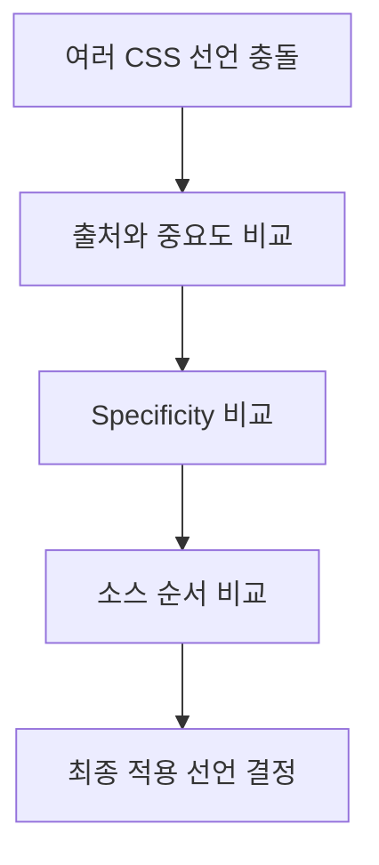

# CSS의 cascade와 specificity란?

#질문

작은 페이지에서는 스타일이 잘 작동하는 것처럼 보인다. 버튼 하나에 색을 입히고 카드 하나에 여백을 주는 일은 어렵지 않다. 문제는 규칙이 수십, 수백 개로 늘어날 때 시작된다. 같은 요소에 여러 선택자가 동시에 걸리고, 나중에 추가한 스타일이 기존 규칙을 덮어쓰면서 "도대체 왜 이 색이 적용됐지?"라는 질문이 계속 생긴다.

이 혼란을 막기 위해 CSS는 아예 규칙 충돌을 계산하는 질서를 언어 안에 넣었다. 그것이 [[Cascade]]와 [[Specificity]]다. 비유하면 회사 결재 라인을 정해 두는 것과 비슷하다. 여러 사람이 같은 문서에 의견을 남기더라도 누가 우선권을 가지는지 규칙이 있어야 최종 결과가 나온다.

우선 cascade는 어떤 선언이 마지막 승자가 되는지 결정하는 전체 흐름이다. 출처가 브라우저 기본 스타일인지, 작성자 스타일인지, 사용자 스타일인지, 그리고 `!important`가 붙었는지, 마지막에 선언됐는지 같은 조건을 차례대로 본다. specificity는 그 안에서 선택자 자체의 "무게"를 따지는 계산법이다. ID 선택자는 클래스보다 무겁고, 클래스는 태그 선택자보다 무겁다.

브라우저 내부에서는 이 규칙이 [[CSSOM]]을 만드는 단계에서 반영된다. 각 노드에 대해 "어떤 선택자가 매칭되는가"를 찾고, 충돌하는 속성마다 우선순위를 계산해 최종 computed style을 만든다. 이 결과가 있어야 [[렌더 트리]]와 [[레이아웃]]이 가능하다. 즉 cascade와 specificity는 문법 지식이 아니라 렌더링의 입력값이다.

이렇게 하면 어떤 일이 생기냐면, 전역 규칙과 지역 규칙을 한 언어 안에서 공존시킬 수 있다. 예를 들어 디자인 시스템의 기본 버튼 스타일이 있어도, 특정 컨텍스트에서 한 단계 더 구체적인 규칙으로 덮어쓸 수 있다. 동시에 이 메커니즘이 과해지면 깊은 선택자, `!important` 남발, 의존 관계가 꼬인 스타일 구조가 만들어진다.

그래서 현대 프론트엔드에서는 단지 "누가 이기느냐"보다 "애초에 왜 이런 싸움이 생기지 않게 설계할 것인가"가 더 중요해졌다. BEM, CSS Modules, 유틸리티 클래스, CSS-in-JS는 모두 cascade를 없애려는 시도가 아니라, 사람이 통제 가능한 범위로 축소하려는 시도라고 보는 편이 정확하다.

결국 cascade와 specificity는 CSS가 대규모 표현 시스템으로 작동하기 위해 넣어 둔 충돌 해결 장치다. 모르면 버그처럼 보이고, 이해하면 규칙처럼 보인다.

---

## 프론트엔드 개발자로써 이 내용을 활용할때 주의할 점

스타일 버그의 상당수는 문법이 아니라 우선순위 설계 실패에서 나온다. 긴 선택자 체인과 `!important`는 빠른 해결책처럼 보여도 나중에는 수정 비용을 폭발시킨다.

실제 활용 단계에서는 컴포넌트별 스타일 경계, 토큰 기반 변수, 레이어 전략을 먼저 정해야 한다. 그래야 cascade를 통제 가능한 도구로 쓸 수 있고, 렌더링 디버깅도 빨라진다.

---

## 🔎 확장 질문

★★★★★ CSS Modules나 CSS-in-JS는 cascade 문제를 어떻게 다른 방식으로 다루는가?

> [!important]
> 둘 다 스타일 스코프를 좁혀 전역 충돌 확률을 낮추려는 방향이다. 언어 자체의 cascade를 없애는 것이 아니라, 사람이 마주치는 충돌 표면적을 줄인다.

★★★★☆ `!important`는 왜 강력하면서도 위험한가?

> [!important]
> 즉시 우선권을 가져오지만, 이후 규칙 설계를 더 높은 강도로 밀어붙이게 만든다. 한 번 남발되기 시작하면 스타일 계층 전체가 무너진다.

★★★☆☆ specificity가 렌더링 성능에도 영향을 줄 수 있는가?

> [!important]
> 지나치게 복잡한 선택자는 스타일 매칭 비용과 디버깅 비용을 늘린다. 대개 병목의 주범은 아니지만, 대규모 문서에서는 무시하기 어렵다.

---

## 🧠 이해 점검 퀴즈

**Q1 (단답형)** 클래스 선택자보다 우선순위가 높은 대표 선택자는 무엇인가?

> [!important]
> ID 선택자.

**Q2 (서술형)** cascade와 specificity의 역할 차이를 설명하라.

> [!important]
> cascade는 충돌 해결의 전체 순서를 정의한다. 출처, 중요도, specificity, 선언 순서를 포함한 큰 규칙이다. specificity는 그중 선택자 자체의 상대적 무게를 계산하는 하위 규칙이다.

**Q3 (설계 의도)** CSS는 왜 충돌을 금지하지 않고 계산 규칙을 언어 안에 포함했는가?

> [!important]
> 전역 테마, 기본 규칙, 예외 규칙이 함께 존재하는 현실을 지원해야 했기 때문이다. 완전한 충돌 금지보다 예측 가능한 충돌 해결이 더 실용적이었다.

---

## 🔎 개념 검증 결과

### ⚠ 기존 개념 재사용
[[CSS]]
[[Cascade]]
[[Specificity]]
[[CSSOM]]
[[렌더 트리]]
[[레이아웃]]

### 🆕 신규 개념 후보

### 🔎 병합 검토 필요
[[Cascade]] ↔ [[Specificity]]
