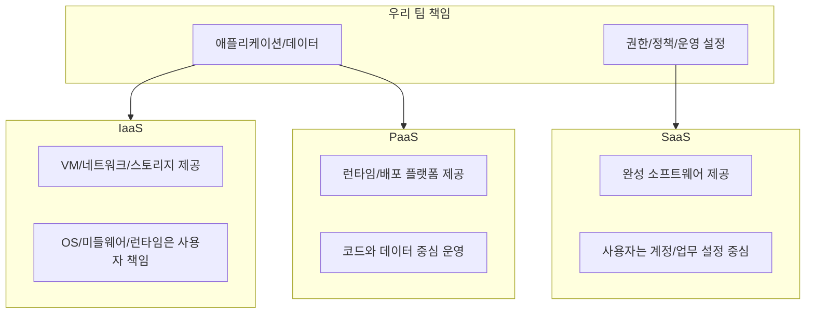

# IaaS, PaaS, SaaS 의 차이와 활용은?

#질문

클라우드를 처음 도입할 때 많은 팀이 같은 혼란을 겪는다. 서버를 직접 관리해야 하는지, 플랫폼에 맡겨도 되는지, 아니면 완성된 소프트웨어를 쓰면 되는지 경계가 흐릿하게 느껴진다. 이 질문이 나온 배경은 단순하다. 서비스 개발 속도는 올리고 싶지만, 운영 복잡도와 통제권은 놓치기 싫기 때문이다.

이 문제를 정리하기 위해 등장한 분류가 [[IaaS]], [[PaaS]], [[SaaS]]다. 세 모델의 본질은 기능 차이가 아니라 책임 분배다. 같은 애플리케이션을 운영해도, 어디까지를 클라우드 사업자에게 맡기고 어디부터를 우리가 가져가는지에 따라 설계와 조직 운영 방식이 완전히 달라진다.

![[assets/images/클라우드-컴퓨팅-구조.svg]]

비유로 먼저 보면 이해가 쉽다. IaaS는 땅과 골조만 빌린 상태라 내부 인테리어와 유지보수를 직접 해야 한다. PaaS는 이미 주방 설비가 갖춰진 공유 주방에 들어가는 느낌이다. 조리법(애플리케이션 코드)에 집중할 수 있다. SaaS는 완성된 식당 서비스를 이용하는 방식이라, 운영은 거의 건드리지 않고 업무 사용에 집중한다.

low-level로 내려가면 경계가 더 명확하다. IaaS에서는 VM, 네트워크, 스토리지 같은 인프라 리소스를 API로 만들고, OS 패치, 런타임 설치, 배포 파이프라인, 스케일 전략을 팀이 책임진다. PaaS는 애플리케이션 런타임과 배포 기반을 플랫폼이 제공해 코드 배포 중심으로 운영하게 만든다. SaaS는 애플리케이션 자체가 서비스로 제공되므로 사용자는 계정, 권한, 데이터 정책 같은 업무 설정에 집중한다.

이렇게 책임이 이동하면 운영 비용 구조도 바뀐다. IaaS는 유연성과 제어권이 큰 대신 운영 인력과 자동화 역량이 필수다. PaaS는 생산성이 높지만 플랫폼 제약에 맞춘 아키텍처 선택이 필요하다. SaaS는 도입 속도가 가장 빠르지만 기능 커스터마이징 한계와 데이터 이동성 이슈를 검토해야 한다. 여기서 자주 등장하는 리스크가 [[Vendor Lock in]]이다.

활용 관점에서 보면 선택 기준은 기술 유행이 아니라 워크로드 특성이다. 규제와 네트워크 토폴로지 제어가 중요한 코어 시스템은 IaaS가 맞는 경우가 많다. 빠르게 제품을 검증해야 하는 스타트업 서비스나 내부 업무앱은 PaaS가 유리하다. 메일, 협업, CRM처럼 차별화 포인트가 아닌 업무 기능은 SaaS가 가장 경제적일 때가 많다.

운영 단계에서는 세 모델을 섞어 쓰는 것이 일반적이다. 예를 들어 고객-facing API는 PaaS에 올려 배포 속도를 높이고, 데이터 파이프라인은 IaaS에서 세밀하게 튜닝하고, 협업도구는 SaaS를 사용한다. 즉 현실의 아키텍처는 "IaaS vs PaaS vs SaaS"의 단일 선택이 아니라, 서비스 경계별 최적 조합 문제다.

---

## 🔎 확장 질문

★★★★★ 같은 서비스를 IaaS에서 PaaS로 옮길 때 아키텍처를 어떤 기준으로 재설계해야 하는가?

> [!important]
> 핵심은 운영 책임의 제거 지점을 먼저 찾는 것이다. OS/런타임 관리, 배포 단위, 상태 저장 방식, 로깅/모니터링 경로를 재정의해야 한다. 단순 이식보다 플랫폼 제약에 맞춘 리팩터링을 해야 성능과 비용이 안정된다.

★★★★☆ SaaS 도입 시 보안과 컴플라이언스 검토는 어떤 순서로 해야 하는가?

> [!important]
> 데이터 분류(민감도)부터 정하고, 저장 위치, 암호화 방식, 접근 로그, 감사 추적, 백업/삭제 정책을 계약서와 실제 기능 양쪽에서 확인해야 한다. 기능 적합성보다 먼저 데이터 거버넌스 적합성을 검증해야 나중 리스크를 줄인다.

★★★☆☆ Vendor Lock-in을 줄이면서도 PaaS 생산성을 유지하려면 어떻게 해야 하는가?

> [!important]
> 애플리케이션 코어 로직은 표준 인터페이스로 분리하고, 플랫폼 특화 기능은 어댑터 계층으로 격리하는 방식이 효과적이다. 데이터 포맷, 메시징 프로토콜, CI/CD 파이프라인을 이식 가능한 형태로 유지하면 전환 비용을 줄일 수 있다.

---

## 🧠 이해 점검 퀴즈

**Q1 (단답형)** IaaS, PaaS, SaaS를 구분하는 가장 핵심 기준은 무엇인가?

> [!important]
> 운영 책임의 경계.

**Q2 (서술형)** 왜 같은 팀이라도 시스템별로 IaaS/PaaS/SaaS를 혼합해 사용하는가?

> [!important]
> 시스템마다 요구사항이 다르기 때문이다. 어떤 영역은 제어권과 튜닝이 중요하고, 어떤 영역은 배포 속도와 생산성이 더 중요하며, 어떤 영역은 직접 개발 가치가 낮다. 그래서 책임, 비용, 속도의 균형을 맞추기 위해 모델을 조합한다.

**Q3 (설계 의도)** 클라우드 서비스 모델을 단일 표준으로 통일하지 않고 계층형으로 제공하는 이유는 무엇인가?

> [!important]
> 조직의 역량과 워크로드 특성이 다양하기 때문이다. 인프라 제어가 필요한 팀도 있고, 코드 개발에만 집중하고 싶은 팀도 있으며, 기능 사용이 목적인 조직도 있다. 계층형 모델은 서로 다른 통제권-생산성 트레이드오프를 선택 가능하게 만든다.

---

## 🔎 개념 검증 결과

### ⚠ 기존 개념 재사용
[[퍼블릭 클라우드]]
[[Shared Responsibility Model]]

### 🆕 신규 개념 후보
[[IaaS]]
[[PaaS]]
[[SaaS]]
[[Vendor Lock in]]

### 🔎 병합 검토 필요
[[PaaS]] ↔ [[SaaS]]
[[Vendor Lock in]] ↔ [[Shared Responsibility Model]]
