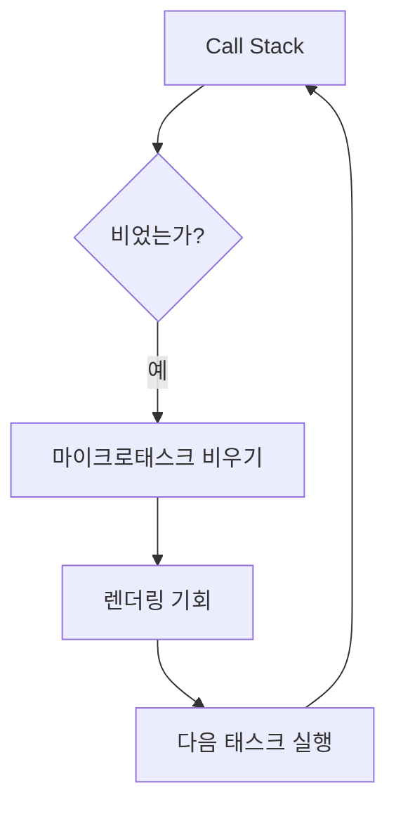

# JS의 이벤트 루프와 UI의 관계

#질문

버튼을 눌렀는데 화면이 멈춘 것처럼 느껴지는 순간이 있다. 네트워크가 느린 경우도 있지만, 많은 경우 문제는 브라우저가 "지금 해야 할 일"을 제때 비우지 못한 데 있다. 웹의 UI는 누군가 별도 스레드에서 독립적으로 계속 그려 주는 시스템이 아니라, 메인 스레드의 여유 시간에 맞춰 갱신되는 구조에 가깝다.

여기서 중심이 되는 것이 [[이벤트 루프]]다. 브라우저는 JavaScript를 한 번에 한 작업씩 처리한다. 동기 코드는 콜스택에서 실행되고, 타이머 완료, 사용자 입력, 네트워크 응답 같은 일은 대기하다가 큐로 들어온다. 이벤트 루프는 스택이 비었을 때 큐의 작업을 꺼내 다시 실행한다.

비유하면 카페에 직원 한 명이 주문 받기, 커피 만들기, 픽업 안내를 모두 맡고 있는 상황과 비슷하다. 손님이 몰릴 때 한 주문에 10분씩 붙잡히면 나머지 손님은 계산조차 못 한다. UI 지연도 같은 원리다. 긴 JavaScript 작업이 메인 스레드를 점유하면 클릭, 스크롤, 렌더링이 뒤로 밀린다.

브라우저는 이 과정에서 [[태스크 큐]]와 [[마이크로태스크]]를 구분한다. `setTimeout`, 사용자 이벤트 같은 일반 작업은 태스크 큐로 가고, `Promise.then`, `queueMicrotask` 같은 작업은 마이크로태스크 큐로 간다. 이벤트 루프는 보통 현재 태스크를 끝낸 뒤, 렌더링 전에 마이크로태스크를 먼저 비운다. 그래서 마이크로태스크를 과도하게 쌓으면 겉보기엔 비동기인데도 화면 갱신이 계속 늦어질 수 있다.

이렇게 보면 UI가 버벅이는 이유가 더 선명해진다. 단순히 "JavaScript가 무겁다"가 아니라, 이벤트 루프가 다음 렌더링 기회를 얻기 전에 너무 많은 일을 처리하고 있는 것이다. 대량 JSON 파싱, 무거운 반복문, 연속 상태 업데이트, 마이크로태스크 폭주가 대표적이다.

실제 서비스에서는 입력창 자동완성, 드래그 인터랙션, 스크롤 연동 애니메이션에서 이 문제가 자주 드러난다. 사용자는 로직이 맞는지보다 "즉시 반응하는가"를 먼저 체감한다. 그래서 이벤트 루프를 이해하는 일은 문법 공부가 아니라, UI 품질을 지키는 일에 가깝다.

결국 이벤트 루프와 UI의 관계는 시간 관리의 문제다. 메인 스레드를 누가 얼마나 오래 점유하는지에 따라, 같은 기능도 부드럽게 느껴질 수도 있고 답답하게 느껴질 수도 있다.

---

## 프론트엔드 개발자로써 이 내용을 활용할때 주의할 점

비동기라고 해서 자동으로 가벼운 것이 아니다. `Promise` 체인이 길거나 마이크로태스크를 과하게 생성하면 렌더링 기회를 계속 늦출 수 있다.

실제 활용 단계에서는 긴 작업 분할, `requestAnimationFrame` 활용, 입력 처리 디바운스, Web Worker 분리 여부를 판단해야 한다. UI 성능 문제를 네트워크 탓으로 돌리기 전에 이벤트 루프 점유 시간을 먼저 확인하는 습관이 필요하다.

---

## 🔎 확장 질문

★★★★★ 마이크로태스크가 많아지면 왜 렌더링이 지연될 수 있는가?

> [!important]
> 이벤트 루프는 보통 다음 렌더링 전에 마이크로태스크를 우선 비운다. 마이크로태스크가 계속 추가되면 화면이 그려질 틈이 줄어든다.

★★★★☆ Web Worker는 이벤트 루프 병목을 어디까지 해결해 주는가?

> [!important]
> 계산을 메인 스레드 밖으로 옮겨 점유 시간을 줄여 주지만, DOM 직접 조작은 못 한다. 그래서 연산 분리와 UI 갱신 분리를 함께 설계해야 한다.

★★★☆☆ React 같은 프레임워크는 이벤트 루프 문제를 없애는가, 아니면 관리하기 쉽게 만드는가?

> [!important]
> 대부분 후자다. 프레임워크는 상태와 업데이트를 조직적으로 다루게 해 주지만, 메인 스레드 시간 자체를 마법처럼 없애지는 못한다.

---

## 🧠 이해 점검 퀴즈

**Q1 (단답형)** `Promise.then` 콜백은 일반적으로 어떤 큐에서 처리되는가?

> [!important]
> 마이크로태스크 큐.

**Q2 (서술형)** 긴 JavaScript 작업이 왜 UI 지연으로 이어지는지 설명하라.

> [!important]
> 메인 스레드가 긴 작업을 처리하는 동안 입력 이벤트 처리와 렌더링 기회가 뒤로 밀리기 때문이다. 이벤트 루프가 다음 작업과 렌더링으로 넘어가지 못해 사용자는 멈춤처럼 느낀다.

**Q3 (설계 의도)** 브라우저는 왜 모든 일을 동시에 처리하기보다 이벤트 루프 기반 단일 흐름을 유지하는가?

> [!important]
> DOM과 렌더링 상태를 예측 가능하게 유지하기 위해서다. 대신 큐와 비동기 모델을 통해 대기 시간을 숨기고, 필요한 시점에 작업을 재개한다.

---

## 🔎 개념 검증 결과

### ⚠ 기존 개념 재사용
[[JavaScript]]
[[이벤트 루프]]
[[태스크 큐]]
[[마이크로태스크]]

### 🆕 신규 개념 후보

### 🔎 병합 검토 필요
[[태스크 큐]] ↔ [[마이크로태스크]]
