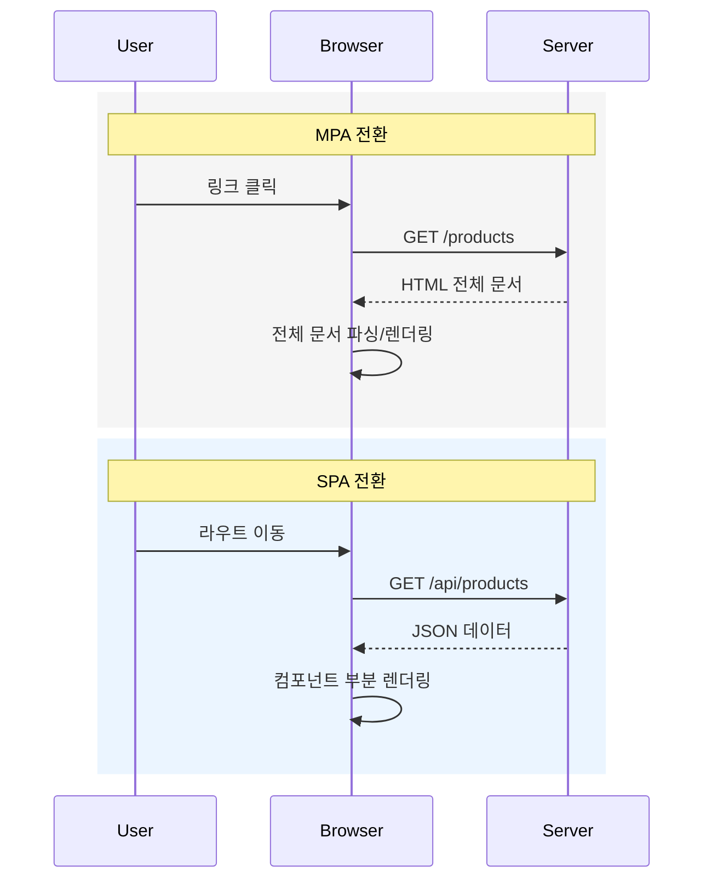

# SPA와 MPA는 뭘까?
#질문

## 1. 등장 배경
초기 웹은 문서를 읽는 공간에 가까웠다. 링크를 누르면 서버가 새 HTML 문서를 만들고, 브라우저는 화면을 통째로 갈아끼웠다. 이 방식이 오늘날 [[MPA]]의 기본 동작이다. 구조는 단순했고 서버 중심으로 운영하기 쉬웠다.

문제는 웹이 문서에서 애플리케이션으로 바뀌면서 시작됐다. 메일, 지도, 대시보드처럼 화면 일부만 자주 바뀌는 서비스에서 매번 전체 페이지를 다시 받는 비용이 커졌다. 네트워크 왕복이 반복되고, 스크롤 위치나 UI 상태가 자주 초기화됐다.

그래서 등장한 선택이 [[SPA]]다. 첫 진입 때 앱 셸을 내려받고, 이후에는 필요한 데이터만 API로 가져와 화면 일부를 갱신한다. 핵심 목표는 "전체 새로고침 없이 상호작용을 연속적으로 유지"하는 것이다.

## 2. 구조적 전환
MPA는 "요청 1번 = HTML 1장"이라는 서버 렌더링 중심 모델이다. URL마다 서버 템플릿이 대응하고, 전환마다 문서 전체가 교체된다. 반면 SPA는 "요청 1번 = 데이터 단위" 모델로 이동한다. 화면 전환은 서버가 아니라 브라우저의 [[CSR]] 로직이 담당한다.

이때 라우팅의 책임도 바뀐다. MPA에서는 서버 라우터가 URL을 해석해 HTML을 반환한다. SPA에서는 클라이언트 라우터가 URL을 해석해 컴포넌트를 교체하고, 주소 표시는 [[브라우저 히스토리 API]]로 동기화한다. 서버는 주로 JSON API를 제공하고, 앱 상태 관리는 클라이언트가 맡는다.

![[assets/images/Web-browsing-client-server-wikimedia.png]]

> 출처: Wikimedia Commons (Client-server model example (Web browsing) - en)
> 라이선스: CC BY-SA 4.0
> 접근일: 2026-03-03

## 3. 내부 동작 원리 (Low-Level)
MPA 요청에서는 브라우저가 새 문서를 받으면 기존 DOM 트리를 버리고 새 DOM을 만든다. CSSOM 결합, 레이아웃, 페인트가 다시 수행된다. 자바스크립트 컨텍스트도 페이지 단위로 재시작되기 쉽다.

SPA는 첫 로드에서 번들(JS, CSS, 기본 HTML)을 받고 실행 컨텍스트를 유지한다. 이후 전환은 데이터 요청 중심이다. 라우트 변경 시 컴포넌트 트리 일부만 재계산되고, 가상 DOM 또는 반응형 시그널 기반 diff로 변경된 노드만 실제 DOM에 반영된다.

SSR이 결합된 SPA 프레임워크에서는 첫 화면을 [[SSR]]로 빠르게 보여준 뒤, 클라이언트가 이벤트 바인딩을 복원하는 [[하이드레이션]]이 일어난다. 그래서 체감 초기 속도와 상호작용 속도를 동시에 확보하려 한다.

> [!important]
> SPA와 MPA의 low-level 차이는 "문서 교체 단위"다. MPA는 페이지 단위 교체, SPA는 상태 기반 부분 교체다.

## 4. 활용
콘텐츠 중심 서비스, 검색엔진 노출이 중요한 마케팅 페이지, 서버 템플릿 조직에서는 MPA가 여전히 강하다. 캐시 전략과 서버 사이드 로깅이 단순하고 운영 모델이 명확하다.

반대로 협업 툴, 관리자 대시보드, 메신저, 복잡한 폼 워크플로우에서는 SPA가 유리하다. 화면 전환이 잦고 인터랙션 밀도가 높을수록 부분 렌더링 이점이 커진다.

실무에서는 둘 중 하나만 고집하지 않는다. 랜딩/문서 영역은 MPA 또는 SSR 중심, 앱 내부는 SPA 상호작용으로 분리한 하이브리드 구성이 일반적이다.

## 5. 한계와 이후 발전
MPA의 한계는 전환 비용과 상태 단절이다. SPA의 한계는 초기 번들 크기, 클라이언트 복잡도, SEO/접근성 관리 부담이다. SPA가 커질수록 상태 동기화, 에러 복구, 캐시 무효화가 어려워진다.

그래서 발전 방향은 경계 재설계로 흘렀다. 코드 스플리팅, 스트리밍 SSR, 점진적 하이드레이션, 서버 컴포넌트 같은 방식으로 "초기 렌더는 서버", "상호작용은 클라이언트"를 세밀하게 분할한다. 결론적으로 SPA 대 MPA는 승패 문제가 아니라, 서비스 요구에 맞는 렌더링 책임 배분 문제다.

## 6. 🔎 확장 질문
- ★★★★★ 왜 대규모 SaaS는 순수 MPA보다 SPA 또는 하이브리드 구조를 선호하는가?
> [!important]
> 사용자 상호작용 밀도가 높아 전체 문서 재요청 비용이 누적되기 때문이다. 상태를 유지한 채 부분 갱신하면 전환 지연과 UX 단절을 줄일 수 있다.

- ★★★★☆ SSR과 하이드레이션을 함께 쓰는 이유는 무엇인가?
> [!important]
> SSR은 첫 화면 도달 시간을 줄이고, 하이드레이션은 그 화면을 상호작용 가능한 앱으로 전환한다. 초기 표시 성능과 이후 조작성의 균형을 맞추기 위한 조합이다.

- ★★★☆☆ SPA 라우팅에서 브라우저 히스토리 API가 중요한 이유는 무엇인가?
> [!important]
> 전체 새로고침 없이 URL/뒤로가기/앞으로가기 동작을 브라우저 기본 경험과 일치시키기 위해서다. 주소와 화면 상태를 분리하면 탐색 일관성이 깨진다.

## 7. 🧠 이해 점검 퀴즈
- 단답형: 전체 문서를 다시 내려받지 않고 주소를 바꾸는 SPA의 핵심 브라우저 기능은 무엇인가?
> [!important]
> 브라우저 히스토리 API

- 서술형: MPA의 페이지 전환과 SPA의 페이지 전환이 네트워크 요청 단위와 DOM 업데이트 단위에서 어떻게 다른지 설명하라.
> [!important]
> MPA는 전환마다 새 HTML 문서를 요청하고 DOM/CSSOM을 문서 단위로 다시 구성한다. SPA는 전환 시 데이터(API) 위주로 요청하고 변경된 컴포넌트/노드만 부분 업데이트한다.

- 왜 이런 설계를 했는가?: 웹 프레임워크들이 SPA 단일 모델에서 하이브리드(SSR+CSR)로 이동한 이유는 무엇인가?
> [!important]
> 순수 SPA는 초기 로드와 SEO 부담이 크고, 순수 MPA는 상호작용 연속성이 약하기 때문이다. 하이브리드는 각 모델의 약점을 상쇄해 초기 성능, 검색 노출, 상호작용성을 동시에 맞추려는 설계다.

## 🔎 개념 검증 결과

### ⚠ 기존 개념 재사용
- [[HTTP]]
- [[클라이언트 서버 모델]]

### 🆕 신규 개념 후보
- [[SPA]]
- [[MPA]]
- [[CSR]]
- [[SSR]]
- [[하이드레이션]]
- [[브라우저 히스토리 API]]

### 🔎 병합 검토 필요
- [[웹]] ↔ [[월드 와이드 웹]]
- [[SPA]] ↔ [[CSR]]
