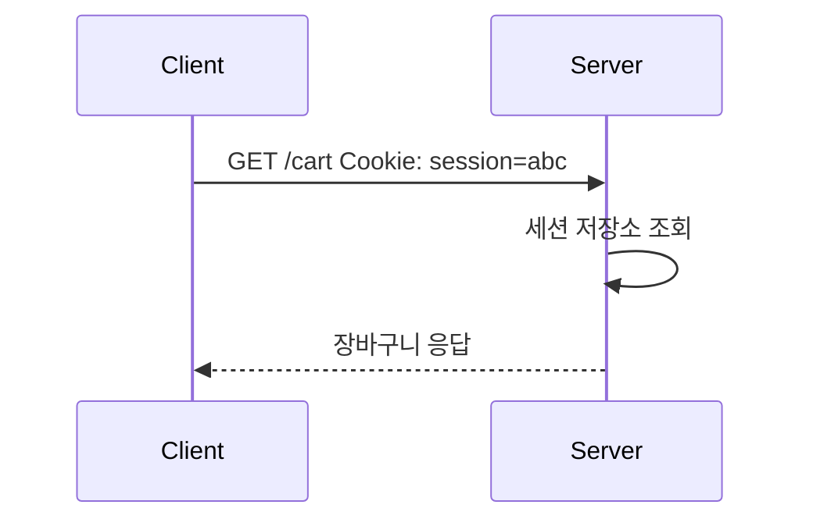

# stateless는 뭐고 왜 HTTP야?

#질문

사람과 사람의 대화는 보통 맥락을 기억한다. 방금 커피를 주문했다면 다음 문장에서는 "설탕은 두 개"만 말해도 앞선 문맥이 이어진다. 그런데 웹의 기본 요청-응답 모델은 이런 식으로 움직이지 않는다. 브라우저가 서버에 요청을 보내면, 서버는 그 요청 하나만 보고 답을 내려야 하는 경우가 많다. 이것이 [[Stateless]]의 출발점이다.

[[HTTP]]는 기본적으로 요청 하나하나를 독립적으로 처리하는 프로토콜이다. 서버가 이전 요청의 상태를 반드시 기억해야 한다고 가정하지 않는다. 그래서 같은 사용자가 `/cart`를 요청했는지, 방금 로그인했는지, 직전에 어떤 페이지를 봤는지는 요청 자체나 별도 저장소를 통해 전달받지 않으면 알 수 없다.

이 구조가 채택된 이유는 단순함과 확장성에 있다. 비유하면 은행 창구 직원이 손님마다 지난 방문 기록을 머릿속에 들고 있는 대신, 매번 번호표와 서류를 보고 업무를 처리하는 방식이다. 조금 차갑게 느껴질 수는 있지만, 창구를 여러 개로 늘리기 쉽고 특정 직원이 자리를 비워도 업무를 이어받기 쉽다.

low-level에서 보면 HTTP 서버는 소켓 연결 위에서 들어온 요청 메시지를 해석하고, 메서드와 헤더, 바디를 기준으로 응답을 만든다. 이때 애플리케이션이 세션을 직접 관리하지 않는 한, 프로토콜 자체는 "이 요청이 이전 요청과 어떤 관계인지"를 강제하지 않는다. 그래서 로그인 상태, 장바구니, CSRF 토큰 같은 정보는 쿠키나 토큰, 서버 저장소를 이용해 별도 계층에서 보완된다.

이렇게 하면 어떤 일이 생기냐면, 서버 인스턴스를 수평 확장하기 쉽고 캐시 계층도 구성하기 쉬워진다. 반대로 완전한 stateless만으로는 현실 서비스가 동작하기 어렵다. 사용자는 연속된 경험을 기대하기 때문이다. 그래서 웹은 stateless 프로토콜 위에 상태를 흉내 내는 장치들을 덧씌우며 발전했다.

결국 "왜 HTTP가 stateless냐"라는 질문은 "왜 웹은 기본 전송 계층에서 확장성을 우선했느냐"라는 질문과 가깝다. 상태를 기억하지 않는 쪽이 더 단순하고 분산에 유리했기 때문에, 필요한 상태는 애플리케이션 계층에서 선택적으로 올리는 설계를 택한 것이다.

---

## 프론트엔드 개발자로써 이 내용을 활용할때 주의할 점

HTTP가 stateless라는 사실을 잊으면 인증, 캐싱, 재시도 로직을 잘못 설계하기 쉽다. 브라우저가 "자동으로 맥락을 기억해 주겠지"라고 가정하면 곧바로 버그로 이어진다.

실제 활용 단계에서는 쿠키, 토큰, 캐시 헤더, 멱등성, 인증 만료 처리를 함께 봐야 한다. 프론트엔드는 단순히 API를 호출하는 쪽이 아니라, stateless 위에 세션 같은 경험을 조합하는 쪽에 가깝다.

---

## 🔎 확장 질문

★★★★★ 쿠키와 토큰은 stateless한 HTTP 위에서 어떤 방식으로 상태를 흉내 내는가?

> [!important]
> 요청마다 식별자나 인증 정보를 함께 실어 보내 서버가 관련 상태를 다시 찾아오게 만든다. 프로토콜이 상태를 들고 있는 것이 아니라, 요청이 상태 조회의 단서를 제공하는 구조다.

★★★★☆ REST에서 stateless 제약은 왜 중요하게 다뤄지는가?

> [!important]
> 각 요청이 스스로를 설명해야 중간 계층, 캐시, 확장이 단순해진다. 상태 의존이 강해질수록 분산 시스템의 이점이 줄어든다.

★★★☆☆ HTTP/2나 HTTP/3가 등장해도 stateless라는 성격은 유지되는가?

> [!important]
> 그렇다. 전송 효율과 연결 방식은 바뀌어도, 요청 자체가 이전 요청 문맥을 반드시 포함한다고 가정하지 않는 특성은 유지된다.

---

## 🧠 이해 점검 퀴즈

**Q1 (단답형)** 이전 요청 상태를 기본적으로 기억하지 않는 성질을 뭐라고 하는가?

> [!important]
> Stateless.

**Q2 (서술형)** HTTP가 stateless하다는 말의 의미를 설명하라.

> [!important]
> 서버가 각 요청을 독립적으로 처리할 수 있다는 뜻이다. 이전 요청의 문맥은 프로토콜이 자동 보장하지 않으므로, 필요하면 쿠키나 토큰 같은 정보를 요청에 포함해야 한다.

**Q3 (설계 의도)** 웹은 왜 기본 프로토콜에서 상태를 자동 유지하지 않도록 설계했는가?

> [!important]
> 서버 확장과 장애 복구, 중간 계층 구성, 캐싱을 단순하게 만들기 위해서다. 상태 유지의 편의보다 분산 시스템 운영의 실용성을 우선했다.

---

## 🔎 개념 검증 결과

### ⚠ 기존 개념 재사용
[[HTTP]]
[[Stateless]]

### 🆕 신규 개념 후보

### 🔎 병합 검토 필요
[[HTTP]] ↔ [[Stateless]]
