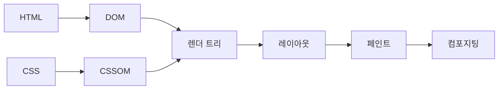

# 렌더링 파이프라인과 렌더링 최적화 방법

#질문

브라우저가 HTML을 받았다고 해서 곧바로 화면이 완성되는 것은 아니다. 사람이 설계도를 받았다고 즉시 건물이 서지 않는 것과 비슷하다. 문서를 해석하고, 어떤 요소를 그려야 할지 결정하고, 어디에 놓을지 계산하고, 마지막으로 픽셀로 칠하는 단계가 필요하다. 이 흐름을 이해하지 못하면 렌더링 성능 문제는 늘 감으로만 다루게 된다.

브라우저는 먼저 HTML을 파싱해 [[DOM]]을 만들고, CSS를 파싱해 [[CSSOM]]을 만든다. 두 정보를 합쳐 실제 화면에 보이는 노드만 담은 [[렌더 트리]]를 구성한다. 그다음 [[레이아웃]]에서 각 박스의 위치와 크기를 계산하고, [[페인트]]에서 색과 글자, 그림자를 그릴 명령을 만든다. 마지막 [[컴포지팅]] 단계에서 레이어를 합쳐 사용자가 보는 프레임을 완성한다.

![[assets/images/HTML-DOM-트리.svg]]

이 파이프라인을 집 꾸미기에 비유하면 DOM은 방 구조, CSSOM은 인테리어 규칙, 렌더 트리는 실제로 손봐야 할 방 목록이다. 레이아웃은 가구 배치, 페인트는 벽지와 색칠, 컴포지팅은 각 방 사진을 한 장의 안내 책자로 묶는 단계라고 생각하면 된다.

문제는 어떤 변경이 어느 단계까지 영향을 주는지다. 텍스트 색을 바꾸면 대개 레이아웃은 건드리지 않고 페인트 정도에서 끝날 수 있다. 반면 요소의 너비나 폰트 크기를 바꾸면 레이아웃을 다시 계산해야 한다. `transform`과 `opacity`는 많은 경우 컴포지팅 선에서 처리되지만, `top`과 `left` 변경은 더 앞단을 흔들 수 있다. 그래서 최적화는 "코드를 줄이는 것"보다 "변경이 파이프라인 어디까지 전파되는지 줄이는 것"에 가깝다.

또 하나 중요한 개념이 [[크리티컬 렌더링 패스]]다. 사용자가 첫 화면을 보기까지 반드시 필요한 리소스가 너무 많으면 DOM과 CSSOM 구성 자체가 늦어진다. 큰 CSS 파일, 차단형 스크립트, 과도한 웹폰트는 첫 페인트를 밀어낸다. 그래서 초기 화면에 필요한 것과 나중에 불러와도 되는 것을 분리하는 전략이 중요하다.

결국 렌더링 최적화는 마법 같은 트릭이 아니라 브라우저가 무엇을 언제 계산하는지 이해하는 일이다. 파이프라인을 모르고 최적화를 하면 우연히 빨라질 수는 있어도 재현 가능하게 빨라지지는 않는다.

---

## 프론트엔드 개발자로써 이 내용을 활용할때 주의할 점

성능 문제를 한 단어로 묶지 말아야 한다. "느리다"는 말 뒤에는 초기 렌더링 지연, 레이아웃 쓰래싱, 페인트 과다, 메인 스레드 병목이 서로 다른 원인으로 숨어 있다.

실제 활용 단계에서는 크리티컬 리소스 최소화, 레이아웃 유발 속성 변경 축소, 레이어 남용 방지, DevTools 성능 패널 확인이 중요하다. 최적화는 추측이 아니라 파이프라인 단계별 계측으로 해야 한다.

---

## 🔎 확장 질문

★★★★★ 레이아웃 쓰래싱은 왜 작은 코드에도 큰 성능 문제를 만들 수 있는가?

> [!important]
> 읽기와 쓰기를 번갈아 수행하면 브라우저가 강제로 레이아웃 계산을 반복하게 된다. 코드 양은 적어도 프레임마다 비용이 누적될 수 있다.

★★★★☆ 크리티컬 렌더링 패스는 초기 로딩 전략과 어떻게 연결되는가?

> [!important]
> 첫 화면에 필요한 리소스를 먼저 확보해야 첫 페인트가 빨라진다. 초기 렌더링에 불필요한 CSS와 스크립트를 늦추면 체감 속도가 좋아진다.

★★★☆☆ GPU 레이어를 많이 만드는 것이 항상 좋은 최적화는 아닌 이유는 무엇인가?

> [!important]
> 일부 애니메이션에는 유리하지만, 레이어가 많아지면 메모리와 컴포지팅 비용이 늘 수 있다. 최적화 기법도 비용 구조를 같이 봐야 한다.

---

## 🧠 이해 점검 퀴즈

**Q1 (단답형)** DOM과 CSSOM을 결합해 실제 화면에 그릴 노드만 담는 구조는 무엇인가?

> [!important]
> 렌더 트리.

**Q2 (서술형)** 렌더링 파이프라인의 주요 단계를 순서대로 설명하라.

> [!important]
> HTML과 CSS를 파싱해 DOM과 CSSOM을 만든 뒤 렌더 트리를 구성한다. 이후 레이아웃으로 위치와 크기를 계산하고, 페인트로 그릴 명령을 만들고, 컴포지팅으로 레이어를 합쳐 최종 화면을 만든다.

**Q3 (설계 의도)** 브라우저는 왜 렌더링을 한 번에 처리하지 않고 여러 단계로 나누는가?

> [!important]
> 구조 파악, 스타일 계산, 배치, 그리기, 합성을 분리해야 변경 영향 범위를 줄이고 부분 최적화를 할 수 있기 때문이다. 단계 분리는 성능 관리의 전제다.

---

## 🔎 개념 검증 결과

### ⚠ 기존 개념 재사용
[[DOM]]
[[CSSOM]]
[[렌더 트리]]
[[레이아웃]]
[[페인트]]
[[컴포지팅]]
[[크리티컬 렌더링 패스]]

### 🆕 신규 개념 후보

### 🔎 병합 검토 필요
[[렌더링 파이프라인과 렌더링 최적화 방법]] ↔ [[크리티컬 렌더링 패스]]
