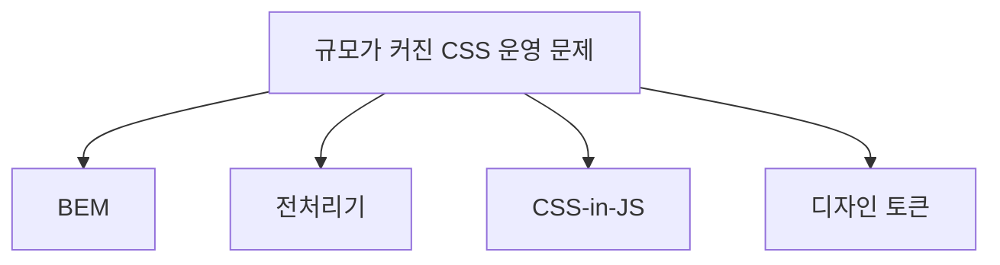

# 방법론(BEM), 전처리기, CSS-in-JS, 디자인 토큰 같은 운영 기법 이란?

#질문

작은 프로젝트에서는 CSS가 단순해 보인다. 파일 몇 개로 끝나고, 클래스 이름도 직관적이며, 규칙 충돌도 눈에 띄면 바로 잡을 수 있다. 그런데 서비스가 커지면 같은 버튼이 페이지마다 조금씩 달라지고, 누군가 작성한 전역 스타일이 다른 화면을 깨뜨리며, 브랜드 색을 바꾸는 일도 생각보다 크고 위험한 작업이 된다.

이 지점에서 필요한 것은 새로운 스타일 언어가 아니라, CSS를 운영하기 위한 질서다. [[BEM]], [[CSS 전처리기]], [[CSS in JS]], [[디자인 토큰]]은 모두 이 운영 문제에 대한 다른 답변들이다. 공통 목표는 대개 비슷하다. 이름 충돌을 줄이고, 재사용을 늘리고, 변경 비용을 예측 가능하게 만드는 것이다.

BEM은 클래스 이름에 구조를 부여해 사람이 읽을 수 있는 규칙을 만든다. 버튼의 블록, 요소, 수정자를 이름 안에 드러내서 "이 클래스가 어디 소속이고 어떤 변형인가"를 추적하기 쉽게 만든다. 전처리기는 변수, 믹스인, 중첩처럼 CSS가 원래 제공하지 않던 작성 편의 기능을 더해 반복을 줄인다.

CSS-in-JS는 스타일을 컴포넌트 단위 코드 가까이에 두고, 런타임이나 빌드 타임에 스코프를 관리한다. 디자인 토큰은 색, 간격, 폰트 크기 같은 값을 시스템 차원의 공용 언어로 만드는 접근이다. 즉 BEM이 네이밍 질서라면, 전처리기는 작성 보조 도구, CSS-in-JS는 스코프와 컴포넌트 결합 전략, 디자인 토큰은 값의 일관성을 위한 계약이라고 볼 수 있다.

이 운영 기법들이 등장한 배경은 결국 [[Cascade]]와 [[Specificity]]를 사람이 통제하기 어려워졌기 때문이다. CSS 자체는 강력하지만 전역 규칙이 많아질수록 추론 비용이 커진다. 그래서 "브라우저가 이해하는 CSS" 위에 "팀이 이해하는 규칙"을 한 층 더 올리게 된 것이다.

어느 하나가 절대적 정답은 아니다. 정적 사이트, 디자인 시스템, 대규모 React 애플리케이션, 멀티플랫폼 제품군은 서로 다른 운영 비용을 가진다. 중요한 건 도구 이름이 아니라, 내 프로젝트에서 가장 큰 스타일 문제를 정확히 짚는 것이다.

결국 이 기법들은 CSS를 더 화려하게 만들기 위한 장식이 아니라, 규모가 커졌을 때도 CSS가 무너지지 않게 붙잡아 두는 운영 장치다.

---

## 프론트엔드 개발자로써 이 내용을 활용할때 주의할 점

도구를 유행으로 선택하면 실패한다. 현재 팀의 컴포넌트 구조, 디자인 시스템 성숙도, SSR 요구, 빌드 비용을 먼저 봐야 한다.

실제 활용 단계에서는 "우리 팀이 가장 자주 겪는 스타일 장애가 무엇인가"를 기준으로 선택해야 한다. 전역 충돌이 문제면 네이밍과 스코프가, 브랜드 일관성이 문제면 토큰이, 반복 작성이 문제면 전처리기나 유틸리티가 더 직접적인 해법이 된다.

---

## 🔎 확장 질문

★★★★★ 디자인 토큰은 왜 단순 상수 모음이 아니라 시스템 계약으로 봐야 하는가?

> [!important]
> 토큰은 값 하나를 재사용하는 수준을 넘어, 브랜드와 플랫폼 전반에서 동일한 의미를 공유하게 만든다. 색상 하나를 바꾸는 일이 시스템 전체 정책 변경으로 이어질 수 있다.

★★★★☆ CSS-in-JS는 어떤 상황에서 강점보다 비용이 커질 수 있는가?

> [!important]
> 런타임 오버헤드, SSR 복잡도, 디버깅 비용이 팀 상황과 맞지 않으면 오히려 부담이 된다. 컴포넌트 결합이 장점이지만 항상 무료는 아니다.

★★★☆☆ BEM은 오래된 방식처럼 보이는데도 왜 여전히 유효한가?

> [!important]
> 복잡한 도구 없이도 클래스 네이밍과 책임 분리를 명시적으로 강제하기 때문이다. 단순하지만 사람의 추론 비용을 줄이는 효과는 여전히 크다.

---

## 🧠 이해 점검 퀴즈

**Q1 (단답형)** 색상, 간격, 타이포그래피 값을 시스템 차원의 공용 언어로 다루는 접근은 무엇인가?

> [!important]
> 디자인 토큰.

**Q2 (서술형)** BEM, 전처리기, CSS-in-JS가 각각 해결하려는 문제의 초점을 비교하라.

> [!important]
> BEM은 네이밍과 책임 분리, 전처리기는 작성 효율과 반복 감소, CSS-in-JS는 스코프 관리와 컴포넌트 결합에 초점을 둔다. 셋 다 CSS 운영 문제를 다루지만 중심 포인트가 다르다.

**Q3 (설계 의도)** CSS 위에 별도 운영 규칙과 도구가 계속 생겨난 이유는 무엇인가?

> [!important]
> CSS 자체는 표현 언어로 충분히 강력하지만, 규모가 커질수록 사람이 규칙 충돌과 값 일관성을 추론하기 어려워지기 때문이다. 운영 복잡도를 줄이기 위한 추가 계층이 필요했다.

---

## 🔎 개념 검증 결과

### ⚠ 기존 개념 재사용
[[BEM]]
[[CSS 전처리기]]
[[CSS in JS]]
[[디자인 토큰]]
[[Cascade]]
[[Specificity]]

### 🆕 신규 개념 후보

### 🔎 병합 검토 필요
[[CSS in JS]] ↔ [[디자인 토큰]]
