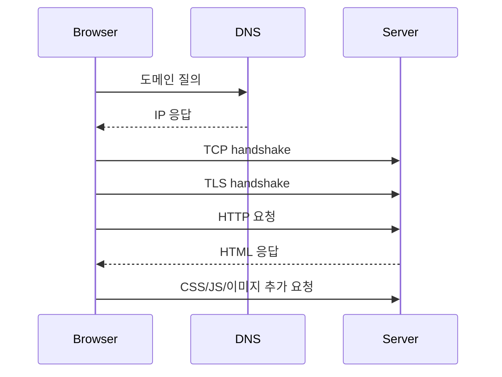

# 브라우저가 URL을 입력하면 DNS → TCP → TLS → HTTP → 렌더링까지 실제 내부에서 어떤 일이 일어나는가?

#질문

주소창에 `https://example.com`을 입력하고 엔터를 누를 때 사용자는 대개 "페이지 하나를 열었다"고 느낀다. 하지만 브라우저 입장에서는 이름을 숫자로 바꾸고, 연결을 만들고, 상대가 진짜 서버인지 검증하고, 문서를 받아 파싱하고, 그 문서가 참조하는 리소스를 다시 모아 화면으로 조립하는 긴 작업이 연쇄적으로 일어난다. 웹이 단순해 보여도 내부는 꽤 복합적인 이유가 여기 있다.

첫 단계는 [[URL]] 해석이다. 브라우저는 스킴이 `https`인지, 호스트가 무엇인지, 경로가 무엇인지 분리한다. 그다음 호스트 이름을 실제 네트워크 주소로 바꾸기 위해 [[DNS]]를 사용한다. 브라우저 캐시나 운영체제 캐시에 답이 없으면 [[DNS 리졸버]]에 질의하고, 리졸버는 필요할 경우 [[권한 DNS 서버]]까지 따라가 [[IP 주소]]를 알아낸다.

연결 단계에서는 보통 [[TCP]]가 먼저 길을 깐다. 클라이언트와 서버는 [[TCP 3-way handshake]]를 통해 서로 송수신 준비가 되었는지 확인한다. 연결을 닫을 때는 [[TCP 4-way handshake]]처럼 양방향 종료가 따로 처리된다. 비유하면 통화 전에 "들리나요?", "네, 들립니다", "좋습니다"를 확인하고, 끊을 때는 서로 할 말이 끝났는지 따로 확인하는 것과 비슷하다.

그 위에서 `https`라면 [[TLS]]가 이어진다. 브라우저는 서버가 제시한 [[인증서]]를 검증해 정말 의도한 도메인인지 확인하고, 이후 데이터를 암호화할 세션 키를 합의한다. [[HTTPS]]는 별도 프로토콜이 아니라, [[HTTP]]를 TLS 위에서 보내는 방식이라고 보는 편이 정확하다.

HTTP 요청이 시작되면 브라우저는 보통 HTML 문서를 먼저 가져온다. 그런데 화면은 HTML 하나로 끝나지 않는다. 브라우저는 HTML을 파싱하며 `<link>`, `<script>`, `` 같은 참조를 발견하고 CSS, JavaScript, 이미지, 폰트 같은 하위 리소스를 추가로 요청한다. 이 과정에서 캐시가 있으면 네트워크를 건너뛰기도 하고, 연결 재사용으로 일부 비용을 줄이기도 한다.

이후부터는 렌더링 단계다. 브라우저는 HTML로 [[DOM]]을 만들고 CSS로 [[CSSOM]]을 만든 뒤, 둘을 합쳐 [[렌더 트리]]를 구성한다. 이어 [[레이아웃]]으로 박스의 위치와 크기를 계산하고, [[페인트]]로 픽셀 명령을 만들고, [[컴포지팅]]으로 최종 프레임을 합성한다. 이 전체를 [[크리티컬 렌더링 패스]]라고 부르는 맥락이 여기서 생긴다.

중요한 점은 이 흐름이 항상 같은 모양으로 전개되지는 않는다는 것이다. DNS 결과가 캐시에 있으면 첫 단계가 거의 사라질 수 있고, 이미 열린 연결이 있으면 TCP와 TLS 비용도 줄어든다. HTTP/3라면 내부 연결 방식이 달라지기도 한다. 그럼에도 "이름 해석 → 연결 → 보안 검증 → 문서 요청 → 파싱과 렌더링"이라는 큰 순서는 웹 동작을 이해하는 기본 뼈대로 남는다.

결국 주소창 입력은 단순한 클릭이 아니라, 네트워크와 보안, 문서 파싱, 렌더링이 겹쳐 움직이는 하나의 긴 파이프라인이다. 프론트엔드 성능 문제는 이 중 어느 단계가 느린지 구분할 수 있을 때 비로소 정확히 다룰 수 있다.

---

## 프론트엔드 개발자로써 이 내용을 활용할때 주의할 점

느린 페이지를 모두 "렌더링 문제"라고 부르면 원인을 놓친다. 병목은 DNS, 연결 재수립, TLS 검증, HTML 응답, 차단형 CSS, 메인 스레드 점유 중 어디에나 있을 수 있다.

실제 활용 단계에서는 캐시 정책, 연결 재사용, 크리티컬 리소스 최소화, 인증서와 TLS 비용, 렌더링 차단 리소스를 함께 봐야 한다. 네트워크와 렌더링을 분리해서 보지 말고 한 파이프라인으로 봐야 한다.

---

## 🔎 확장 질문

★★★★★ HTTP/2와 HTTP/3는 이 파이프라인의 어느 비용을 줄이려는가?

> [!important]
> 연결 재사용, 다중화, 초기 지연 감소를 통해 요청-응답의 왕복 비용을 줄이려는 방향이다. 결국 같은 문서를 더 적은 대기 시간으로 전달하려는 시도다.

★★★★☆ 브라우저 캐시는 DNS, HTTP, 리소스 수준에서 어떻게 다르게 개입하는가?

> [!important]
> DNS 캐시는 이름 해석 단계, HTTP 캐시는 문서와 리소스 재사용 단계, 메모리 캐시는 현재 세션의 빠른 재참조 단계에 각각 관여한다. 어느 캐시가 적중했는지에 따라 병목 위치가 달라진다.

★★★☆☆ 첫 화면 성능은 네트워크보다 렌더링 차단 리소스의 영향을 더 크게 받을 수 있는가?

> [!important]
> 그렇다. HTML 응답이 빨라도 큰 CSS와 차단형 스크립트가 있으면 첫 페인트가 늦어진다. 전달 속도와 화면 완성 속도는 같은 문제가 아니다.

---

## 🧠 이해 점검 퀴즈

**Q1 (단답형)** 도메인 이름을 IP 주소로 바꾸는 시스템은 무엇인가?

> [!important]
> DNS.

**Q2 (서술형)** URL 입력 후 화면이 보이기까지의 큰 흐름을 설명하라.

> [!important]
> 브라우저는 URL을 해석하고 DNS로 IP를 찾는다. 이후 TCP 연결을 열고, HTTPS라면 TLS로 서버를 검증하고 세션 키를 합의한다. 그런 다음 HTTP로 HTML을 요청하고, 파싱 과정에서 필요한 하위 리소스를 추가 요청한다. 마지막으로 DOM, CSSOM, 렌더 트리, 레이아웃, 페인트, 컴포지팅을 거쳐 화면을 만든다.

**Q3 (설계 의도)** 웹은 왜 한 번의 단순 요청으로 끝나지 않고 이런 다단계 구조를 가지게 되었는가?

> [!important]
> 사람이 읽기 쉬운 도메인 이름, 신뢰 가능한 보안 연결, 재사용 가능한 문서 구조, 다양한 리소스 조합, 범용 브라우저 렌더링을 모두 만족하려면 역할을 나눈 여러 계층이 필요했기 때문이다.

---

## 🔎 개념 검증 결과

### ⚠ 기존 개념 재사용
[[URL]]
[[DNS]]
[[DNS 리졸버]]
[[권한 DNS 서버]]
[[IP 주소]]
[[TCP]]
[[TCP 3-way handshake]]
[[TCP 4-way handshake]]
[[TLS]]
[[인증서]]
[[HTTPS]]
[[HTTP]]
[[DOM]]
[[CSSOM]]
[[렌더 트리]]
[[레이아웃]]
[[페인트]]
[[컴포지팅]]
[[크리티컬 렌더링 패스]]

### 🆕 신규 개념 후보

### 🔎 병합 검토 필요
[[크리티컬 렌더링 패스]] ↔ [[렌더링 파이프라인과 렌더링 최적화 방법]]
